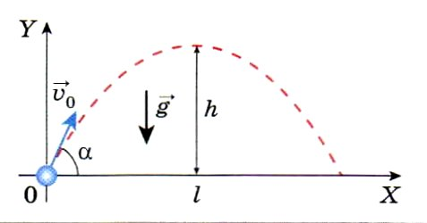
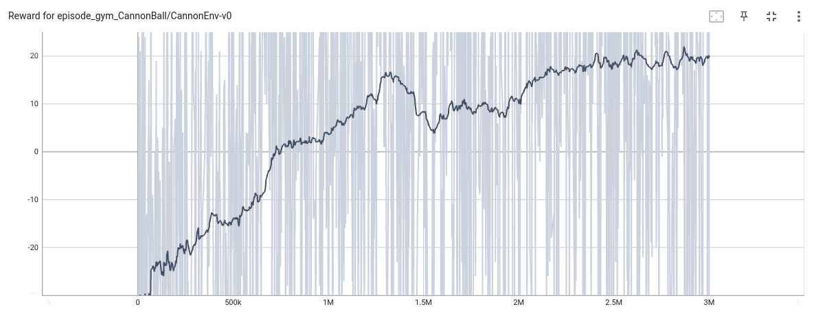
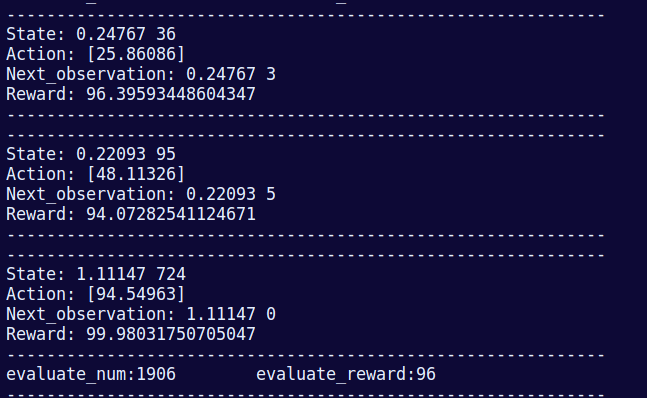

# RL_CannonBall

CannonEnv is a custom reinforcement learning environment built on the OpenAI Gym framework. It simulates the classic physics problem of determining the correct angle and velocity to fire a cannonball to hit a distant target. Actually, is is a toy exaple for understanding RL alogithms with continuous space and continuous action.



**Action Space**: The action space is continuous, representing the initial speed (m/s) of the cannonball. It ranges from 0 to 100 m/s.

**Observation Space**: The observation space is continuous and consists of two values:
The angle (in radians) at which the cannon is currently aimed, ranging from 0 to π/2.
The distance to the target (in meters), ranging from 0 to 1000 meters.

**Physics-Based Simulation**: The environment simulates the trajectory of the cannonball using basic physics equations, taking into account the angle of launch and the initial speed.

**Reward System**: The reward is calculated based on how close the cannonball lands to the target, encouraging the agent to learn the optimal angle and speed for various distances.

**Episodic Nature**: Each episode ends after one shot, and the distance to the target is randomized at the beginning of each episode, providing diverse scenarios for the agent to learn from.

## How it works

**Initialization**: At the start of each episode, the environment randomly selects a target distance and sets a random angle for the cannon.

**Action**: The agent specifies the initial speed of the cannonball.
Simulation: The environment calculates the trajectory of the cannonball based on the given speed and the current angle, then updates the distance to the target.

**Reward**: A reward is given based on how close the cannonball lands to the target, with a higher reward for more accurate shots.

**Episode Termination**: Each episode ends after one shot, allowing the agent to immediately learn from the outcome and prepare for the next attempt.


## Installation
Для того, чтобы установить среду необходимо выполнить следующую команду:
```
pip install -e .
```

## Basic Usage
```
import gym
import gym_CannonBall
import math

env = gym.make('gym_CannonBall/CannonEnv-v0')

env.reset()
action = env.action_space.sample()
obs, reward, done, _,info = env.step(action)
print(f"Observation: {obs}, Reward: {reward}")
env.close()
```

## About Cannon env
Среда представляет собой упрощенную модель выстрела ядра из пушки по заданному углу и расстоянию до цели. В качестве усложения к модели среды добавлен белый шум.

| Environment Id | Observation Space |Action Space| Reward Range | 
| -------------| ------ |------ | -----------|
| CannonEnv-v0 |Box(2,) |Box(1,)|(-100, 100) | 

### State
Наблюдением является заданный угол и расстояние до цели, которые в свою очередь явлюятся числами типа float32.
 
```
state, _ = env.reset()
#state = [angle, distance_to_target]
```

### Action
Действием является начальная скорость ядра (число float32).

### Reward
Награда задается как:
```
reward = max(-100, 100 - abs(diff between target and current ball landing coordinate))
```

## Results with DDPG



